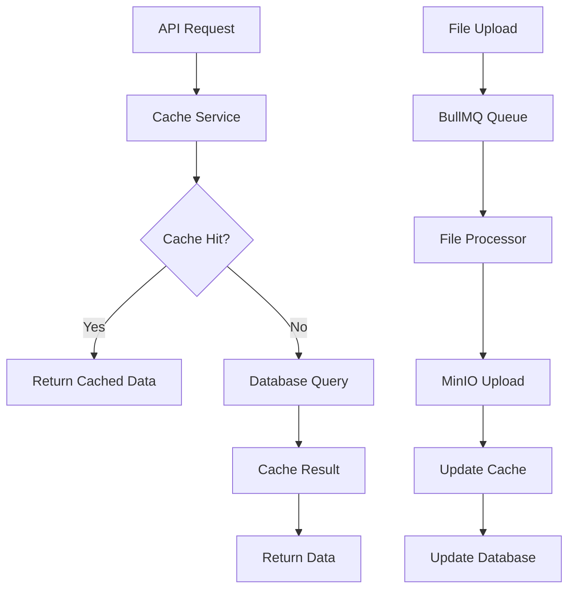
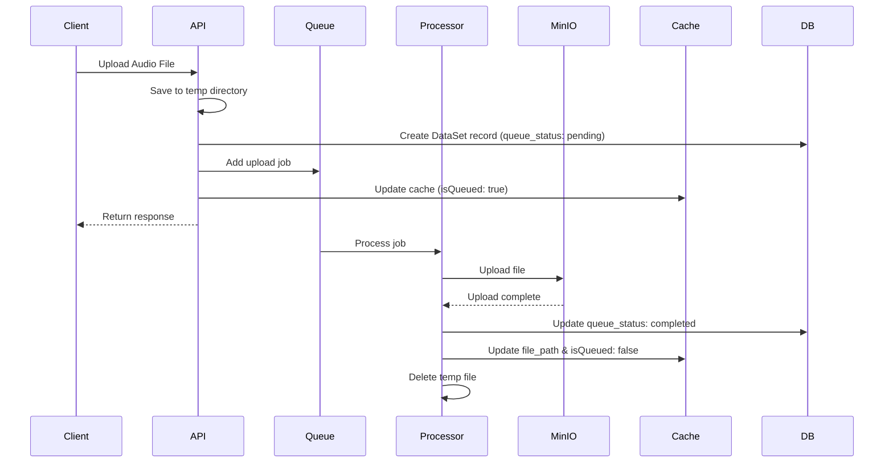

# Redis Integration Guidelines

## Overview

The Leyu API project uses Redis as a caching layer and message broker for background job processing. This document provides comprehensive guidelines for Redis integration, focusing on caching contributor tasks, microtasks, file paths, and managing MinIO file upload queues through BullMQ.

## Table of Contents

- [Architecture Overview](#architecture-overview)
- [Current Implementation](#current-implementation)
- [Cache Strategy](#cache-strategy)
- [BullMQ Integration](#bullmq-integration)
- [File Processing Workflow](#file-processing-workflow)
- [Development Guidelines](#development-guidelines)
- [Performance Optimization](#performance-optimization)
- [Monitoring and Debugging](#monitoring-and-debugging)
- [Production Considerations](#production-considerations)
- [Troubleshooting](#troubleshooting)
- [Best Practices](#best-practices)

## Architecture Overview

### Redis Usage Patterns



### Key Components

1. **Cache Service**: Manages contributor tasks and microtasks caching
2. **BullMQ Integration**: Handles background file processing jobs
3. **File Upload Processor**: Processes audio file uploads to MinIO
4. **Redis Client**: IORedis client for direct Redis operations

## Current Implementation

### Dependencies

```json
{
  "ioredis": "^5.6.1",
  "@nestjs/bullmq": "^11.0.4",
  "bullmq": "^5.66.1"
}
```

### Environment Configuration

```bash
# Redis Connection
REDIS_HOST=localhost
REDIS_PORT=6379
REDIS_URL=redis://localhost:6379
```

### Module Setup

**App Module Configuration**:
```typescript
BullModule.forRoot({
  connection: {
    url: process.env.REDIS_URL,
  },
})
```

**Task Distribution Module**:
```typescript
BullModule.registerQueue({
  name: 'file-upload',
})
```

## Cache Strategy

### Cache Keys Structure

The project uses a structured key naming convention:

```typescript
// Contributor tasks cache
contrib:task:{contributorId}

// Contributor microtasks cache
contrib:task:micro:{taskId}:{contributorId}
```

### Cache Data Types

#### 1. Contributor Tasks Cache

**Purpose**: Cache contributor's assigned tasks with status counts
**TTL**: 12 hours
**Data Structure**:
```typescript
interface ContributorTaskRto {
  id: string;
  title: string;
  approved_count: number;
  rejected_count: number;
  pending_count: number;
  // ... other task properties
}
```

**Usage Example**:
```typescript
// Write to cache
await cacheService.writeContributorTask(contributorId, tasks);

// Read from cache
const tasks = await cacheService.getContributorTasks(contributorId);
```

#### 2. Microtasks Cache

**Purpose**: Cache detailed microtask information including file paths
**TTL**: 12 hours
**Data Structure**:
```typescript
interface TaskMicroTasksResponse {
  contributorMicroTask: {
    id: string;
    acceptance_status: 'APPROVED' | 'REJECTED' | 'PENDING';
    can_retry: boolean;
    current_retry: number;
    allowed_retry: number;
    dataSet?: {
      id: string;
      file_path: string;
      isQueued: boolean;
    };
  }[];
}
```

### Cache Operations

#### Writing Data
```typescript
// Cache contributor tasks
async writeContributorTask(
  contributorId: string,
  payload: ContributorTaskRto[]
): Promise<void> {
  const key = this.contributorTaskKey(contributorId);
  await this.client.set(key, JSON.stringify(payload));
  await this.client.expire(key, 12 * 60 * 60); // 12 hours
}

// Cache microtasks
async writeContributorTaskMicroTasks(
  contributorId: string,
  taskId: string,
  payload: TaskMicroTasksResponse
): Promise<void> {
  const key = this.contributorTaskMicroKey(taskId, contributorId);
  await this.client.set(key, JSON.stringify(payload));
  await this.client.expire(key, 12 * 60 * 60);
}
```

#### Reading Data
```typescript
// Get contributor tasks
async getContributorTasks(contributorId: string): Promise<ContributorTaskRto[]> {
  const key = this.contributorTaskKey(contributorId);
  const raw = await this.client.get(key);
  return raw ? JSON.parse(raw) : [];
}

// Get microtasks
async getContributorTaskMicroTasks(
  taskId: string,
  contributorId: string
): Promise<TaskMicroTasksResponse | null> {
  const key = this.contributorTaskMicroKey(taskId, contributorId);
  const raw = await this.client.get(key);
  return raw ? JSON.parse(raw) : null;
}
```

#### Cache Updates
```typescript
// Update dataset status and maintain cache consistency
async updateDataSetStatus(
  contributorId: string,
  taskId: string,
  microTaskId: string,
  newStatus: 'Approved' | 'Rejected'
): Promise<void> {
  // Update both task counts and microtask status
  const taskObj = await this.getContributorTasks(contributorId);
  const microObj = await this.getContributorTaskMicroTasks(taskId, contributorId);
  
  // Update counters and status
  // ... implementation details
}
```

## BullMQ Integration

### Queue Configuration

**File Upload Queue**:
```typescript
@Processor('file-upload', {
  concurrency: 1, // Process one file at a time
})
export class FileUploadProcessor extends WorkerHost {
  // Implementation
}
```

### Job Processing Workflow

#### 1. Job Creation
```typescript
// Add file upload job to queue
await this.fileQueue.add('upload', {
  path: tempFilePath,
  filename: uniqueFilename,
  mimetype: file.mimetype,
  dataSetId: dataSet.id,
});
```

#### 2. Job Processing
```typescript
async process(job: Job<{
  path: string;
  filename: string;
  mimetype: string;
  dataSetId: string;
}>): Promise<void> {
  const data = job.data;
  
  try {
    // 1. Verify file exists
    await fs.access(data.path);
    
    // 2. Create read stream
    const stream = createReadStream(data.path);
    
    // 3. Upload to MinIO
    const result = await this.fileService.uploadAudioFiles(
      data.filename,
      stream,
      data.mimetype
    );
    
    // 4. Update database and cache
    const filePath = 'audios/' + data.filename;
    await this.dataSetService.updateQueueStatus(
      data.dataSetId,
      'completed',
      filePath
    );
    
    // 5. Clean up temporary file
    await unlinkAsync(data.path);
    
  } catch (error) {
    // Handle failure
    await this.dataSetService.update(data.dataSetId, {
      queue_status: 'failed'
    });
  }
}
```

### Queue Status Management

**Dataset Queue Status**:
- `pending`: File is queued for upload
- `completed`: File successfully uploaded to MinIO
- `failed`: Upload failed

**Cache Integration**:
```typescript
async updateDataSetFilPathAndQueueStatus(
  contributorId: string,
  taskId: string,
  dataSetId: string,
  microTaskId: string,
  filePath: string
): Promise<void> {
  const microObj = await this.getContributorTaskMicroTasks(taskId, contributorId);
  
  if (microObj) {
    // Find and update the specific microtask
    for (const microTask of microObj.contributorMicroTask) {
      if (microTask.id === microTaskId && microTask.dataSet?.id === dataSetId) {
        microTask.dataSet.file_path = filePath;
        microTask.dataSet.isQueued = false;
        await this.writeContributorTaskMicroTasks(contributorId, taskId, microObj);
        break;
      }
    }
  }
}
```

## File Processing Workflow

### Upload Process



### File Access Pattern

**Pre-signed URLs for MinIO**:
```typescript
// Generate pre-signed URLs for file access
async getPreSignedUrl(
  objectKey: string,
  expiresInSeconds = 3600 * 24
): Promise<string> {
  try {
    const command = new GetObjectCommand({
      Bucket: this.bucketName,
      Key: objectKey,
    });
    
    return await getSignedUrl(s3, command, {
      expiresIn: expiresInSeconds,
    });
  } catch (error) {
    return objectKey; // Fallback to original path
  }
}
```

## Development Guidelines

### Adding New Cache Patterns

1. **Define Cache Key Structure**:
```typescript
private newCacheKey(identifier: string): string {
  return `new:cache:${identifier}`;
}
```

2. **Implement Cache Methods**:
```typescript
async writeNewCache(id: string, data: any): Promise<void> {
  if (!this.client) throw new Error('Redis client not initialized');
  
  const key = this.newCacheKey(id);
  await this.client.set(key, JSON.stringify(data));
  await this.client.expire(key, 3600); // 1 hour TTL
}

async getNewCache(id: string): Promise<any | null> {
  if (!this.client) throw new Error('Redis client not initialized');
  
  const key = this.newCacheKey(id);
  const raw = await this.client.get(key);
  return raw ? JSON.parse(raw) : null;
}
```

3. **Add Cache Invalidation**:
```typescript
async invalidateNewCache(id: string): Promise<void> {
  if (!this.client) throw new Error('Redis client not initialized');
  
  const key = this.newCacheKey(id);
  await this.client.del(key);
}
```

### Creating New Job Processors

1. **Define Job Interface**:
```typescript
interface NewJobData {
  id: string;
  payload: any;
  options?: Record<string, any>;
}
```

2. **Create Processor**:
```typescript
@Processor('new-job-queue', {
  concurrency: 5, // Adjust based on requirements
})
export class NewJobProcessor extends WorkerHost {
  constructor(
    private readonly someService: SomeService,
  ) {
    super();
  }

  async process(job: Job<NewJobData>): Promise<void> {
    const { id, payload, options } = job.data;
    
    try {
      // Process the job
      await this.someService.processJob(id, payload, options);
      
      // Update cache if needed
      // Update database if needed
      
    } catch (error) {
      // Handle error
      throw error; // This will trigger retry mechanism
    }
  }
}
```

3. **Register Queue in Module**:
```typescript
@Module({
  imports: [
    BullModule.registerQueue({
      name: 'new-job-queue',
    }),
  ],
  providers: [NewJobProcessor],
})
export class NewJobModule {}
```

## Performance Optimization

### Connection Pooling

**IORedis Configuration**:
```typescript
const redis = new Redis(redisUrl, {
  maxRetriesPerRequest: 3,
  retryDelayOnFailover: 100,
  enableReadyCheck: false,
  maxLoadingTimeout: 1000,
  lazyConnect: true,
  keepAlive: 30000,
});
```

### Memory Management

**Cache Size Limits**:
```typescript
// Set memory policy in Redis configuration
// redis.conf
maxmemory 2gb
maxmemory-policy allkeys-lru
```

**Batch Operations**:
```typescript
// Use pipeline for multiple operations
async batchUpdateCache(updates: Array<{key: string, value: any}>): Promise<void> {
  const pipeline = this.client.pipeline();
  
  updates.forEach(({key, value}) => {
    pipeline.set(key, JSON.stringify(value));
    pipeline.expire(key, 3600);
  });
  
  await pipeline.exec();
}
```

### Queue Optimization

**Job Options**:
```typescript
await this.fileQueue.add('upload', jobData, {
  attempts: 3,
  backoff: {
    type: 'exponential',
    delay: 2000,
  },
  removeOnComplete: 100, // Keep last 100 completed jobs
  removeOnFail: 50,      // Keep last 50 failed jobs
});
```

## Monitoring and Debugging

### Bull Board Integration

**Setup** (already configured in main.ts):
```typescript
// Bull Board for queue monitoring
const myQueue = new Queue('file-upload', {
  connection: {
    host: configService.get<string>('REDIS_HOST'),
    port: configService.get<number>('REDIS_PORT'),
  },
});

const serverAdapter = new ExpressAdapter();
serverAdapter.setBasePath('/admin/queues');

createBullBoard({
  queues: [new BullMQAdapter(myQueue)],
  serverAdapter,
});

app.use('/admin/queues', serverAdapter.getRouter());
```

**Access**: http://localhost:3000/admin/queues

### Cache Monitoring

**Cache Hit Rate Tracking**:
```typescript
class CacheMetrics {
  private hits = 0;
  private misses = 0;

  recordHit(): void {
    this.hits++;
  }

  recordMiss(): void {
    this.misses++;
  }

  getHitRate(): number {
    const total = this.hits + this.misses;
    return total > 0 ? this.hits / total : 0;
  }
}
```

### Logging

**Enhanced Cache Service Logging**:
```typescript
async getContributorTasks(contributorId: string): Promise<ContributorTaskRto[]> {
  const startTime = Date.now();
  const key = this.contributorTaskKey(contributorId);
  
  try {
    const raw = await this.client.get(key);
    const duration = Date.now() - startTime;
    
    if (raw) {
      this.logger.debug(`Cache HIT for ${key} (${duration}ms)`);
      return JSON.parse(raw);
    } else {
      this.logger.debug(`Cache MISS for ${key} (${duration}ms)`);
      return [];
    }
  } catch (error) {
    this.logger.error(`Cache ERROR for ${key}: ${error.message}`);
    return [];
  }
}
```

## Production Considerations

### High Availability

**Redis Cluster Configuration**:
```typescript
const redis = new Redis.Cluster([
  { host: 'redis-node-1', port: 6379 },
  { host: 'redis-node-2', port: 6379 },
  { host: 'redis-node-3', port: 6379 },
], {
  redisOptions: {
    password: process.env.REDIS_PASSWORD,
  },
});
```

**Sentinel Configuration**:
```typescript
const redis = new Redis({
  sentinels: [
    { host: 'sentinel-1', port: 26379 },
    { host: 'sentinel-2', port: 26379 },
    { host: 'sentinel-3', port: 26379 },
  ],
  name: 'mymaster',
  password: process.env.REDIS_PASSWORD,
});
```

### Security

**Authentication**:
```bash
# Environment variables
REDIS_URL=redis://:password@redis-server:6379
REDIS_PASSWORD=strong_password
```

**TLS Configuration**:
```typescript
const redis = new Redis({
  host: 'redis-server',
  port: 6380,
  tls: {
    // TLS options
  },
  password: process.env.REDIS_PASSWORD,
});
```

### Backup and Recovery

**Redis Persistence**:
```bash
# redis.conf
save 900 1      # Save if at least 1 key changed in 900 seconds
save 300 10     # Save if at least 10 keys changed in 300 seconds
save 60 10000   # Save if at least 10000 keys changed in 60 seconds

# Enable AOF
appendonly yes
appendfsync everysec
```

## Troubleshooting

### Common Issues

1. **Connection Timeouts**
```typescript
// Increase timeout settings
const redis = new Redis(redisUrl, {
  connectTimeout: 10000,
  commandTimeout: 5000,
  retryDelayOnFailover: 100,
});
```

2. **Memory Issues**
```bash
# Check Redis memory usage
redis-cli info memory

# Check specific key memory usage
redis-cli memory usage "contrib:task:user123"
```

3. **Queue Stalls**
```bash
# Check queue status
redis-cli llen "bull:file-upload:waiting"
redis-cli llen "bull:file-upload:active"
redis-cli llen "bull:file-upload:failed"
```

### Debug Commands

**Redis CLI Commands**:
```bash
# List all keys matching pattern
redis-cli keys "contrib:task:*"

# Get key TTL
redis-cli ttl "contrib:task:user123"

# Monitor Redis commands
redis-cli monitor

# Check queue contents
redis-cli lrange "bull:file-upload:waiting" 0 -1
```

**Application Debug**:
```typescript
// Add debug logging to cache operations
this.logger.debug(`Cache operation: ${operation} for key: ${key}`);
this.logger.debug(`Cache size: ${JSON.stringify(data).length} bytes`);
```

## Best Practices

### Cache Design

1. **Use Appropriate TTL**: Set TTL based on data volatility
2. **Namespace Keys**: Use consistent key naming conventions
3. **Handle Cache Misses**: Always have fallback to database
4. **Batch Operations**: Use pipelines for multiple operations
5. **Monitor Memory**: Track cache size and hit rates

### Queue Management

1. **Set Job Limits**: Configure appropriate concurrency levels
2. **Handle Failures**: Implement proper error handling and retries
3. **Clean Up**: Remove completed/failed jobs regularly
4. **Monitor Queues**: Track queue depth and processing times
5. **Graceful Shutdown**: Handle application shutdown properly

### Error Handling

1. **Circuit Breaker**: Implement circuit breaker for Redis failures
2. **Fallback Strategy**: Always have database fallback
3. **Retry Logic**: Implement exponential backoff for retries
4. **Logging**: Comprehensive error logging and monitoring
5. **Health Checks**: Regular health checks for Redis connectivity

### Security

1. **Authentication**: Use strong passwords and authentication
2. **Network Security**: Secure Redis network access
3. **Data Encryption**: Encrypt sensitive cached data
4. **Access Control**: Limit Redis command access
5. **Regular Updates**: Keep Redis server updated

## Example Docker Compose

```yaml
version: '3.8'
services:
  redis:
    image: redis:7-alpine
    container_name: leyu-redis
    restart: unless-stopped
    ports:
      - "6379:6379"
    volumes:
      - redis_data:/data
    command: redis-server --appendonly yes --requirepass ${REDIS_PASSWORD}
    environment:
      - REDIS_PASSWORD=${REDIS_PASSWORD}
    networks:
      - leyu-network
    healthcheck:
      test: ["CMD", "redis-cli", "--raw", "incr", "ping"]
      interval: 10s
      timeout: 5s
      retries: 5

volumes:
  redis_data:

networks:
  leyu-network:
    driver: bridge
```

## Resources

- [Redis Documentation](https://redis.io/documentation)
- [IORedis Documentation](https://github.com/luin/ioredis)
- [BullMQ Documentation](https://docs.bullmq.io/)
- [NestJS BullMQ Integration](https://docs.nestjs.com/techniques/queues)
- [Redis Best Practices](https://redis.io/docs/manual/patterns/)

---

**Last Updated**: January 12, 2026  
**Version**: 1.0